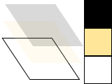
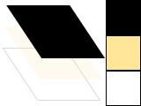
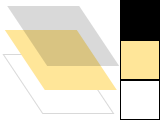
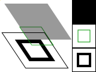
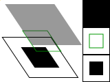
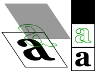
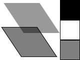

# 写给Python程序员的Cairo教程
# 译序
原文为[Cairo Tutorial for Python Programmers](https://www.tortall.net/mu/wiki/CairoTutorial#cairo-tutorial-for-python-programmers)，原作者为*Michael Urman*。
这篇也算是[PyCairo官方网站](https://pycairo.readthedocs.io/en/latest/resources.html)推荐的教程。
它也被改编并放在了[Cairo官方网站](https://www.cairographics.org/)的教程里。

Cairo是一个绘制矢量图的库。
它能够高性能地生成各种格式的矢量图（svg/PDF/Postscript等）。

翻了一圈好像没有这篇的中文翻译，就自己一边读来学，一边翻译来玩玩。

---
<u>严正声明： 笔者依然认为pgf manual和TikZ都是艺术品以及用于生产艺术品的工具。</u>

我其实一直希望寻找一个好用的绘图库用于画出 **看起来很厉害！** 的示意图。
本来一直用的是TikZ，并且真的去拜读了Till Tantau的那份长达千页pgf manual（的一部分）。
奈何水平不够，只是能够用$\LaTeX$写一些文章，但是对于$\TeX$的编译原理和底层机制不够了解，大大限制了我使用TikZ的上限。
比如，我可以用TikZ画一两张晶格结构图、画几张精美的示意图/流程结构图之类，但没法在此基础上用$\TeX$自己编写稍微复杂的、可复用的绘图包。

因此，我转向学习pycairo。


尽管cairo底层代码是用C语言写就，但pycairo提供了完备的python api。
对于熟悉python的朋友来说，再去写更上层的、属于自己的绘图包，会方便很多。
我们的老朋友，python上数据作图的matplotlib，其底层实现渲染SVG就或多或少基于pycairo（扒开源代码看了眼，多少沾点）。

\[by *FRIEDEEl* 231215\]

# 序言：写给Python程序员的Cairo教程
[Cairo](https://cairographics.org/)是一个强大的2D图形库。
本文档将为你介绍cairo如何工作，也会介绍以及许多你可能用得上的函数。

想要跟上本教程，你可能需要在电脑上安装以下几项：
- [Cairo](https://cairographics.org/snapshots/) 本身
- [python](https://www.python.org/downloads/) 用来运行教程中的代码片段
- [PyCairo](https://cairographics.org/snapshots/) 用于讲以上二者结合

相对地，如果你准备好接受挑战了，那么仅需要上面的cairo一项，就可以把这些例子转换到自己更熟悉的语言和本地环境。
*Nis Martensen* 已经贴心地在[C语言环境下](http://cairographics.org/tutorial/) 干了这件事。

> 注意：所有代码示例中都依赖 cairo 1.2.0 或更高版本来支持 `cairo.SVGSurface` 。
> 另外，有几个例子需要 `push_group()` 和 `pop_group()` ，以及辐射梯度 (radial gradients) 要在 1.4 及以上版本才能正确渲染。
> 必要时，第一项要求可以通过将 `cairo.SVGSurface(filename + '.svg', width, height)` 替换为 `cairo.ImageSurface(cairo.FORMAT_ARGB32, width, height)` 来正确渲染。
> 但说真的，还是强烈建议你升级一下。

## 目录
- 序言：写给Python程序员的Cairo教程
  - 目录
- Cairo 的绘图模型
  - 名词
  - 动作

# Cairo的绘图模型
为了解释Cairo接下来的一系列操作，我们先对Cairo绘图的模型一探究竟。
这里只会涉及少数几个概念，它们会在接下来的方法中反复地被应用。
首先我会介绍*名词(nouns)*：
目标层(destination)
源(source)
遮罩(mask)
以及
语境(context)。
在这之后介绍*动作(verbs)*，它们会提供操纵这些*名词*的方法，并让你画出你想画的图形。
生成示意图的代码会放在[这里]()，但先别急着去读。

> 如果你觉得这些介绍有些啰嗦，*Don Ingle*做了个把所有东西整合在一起的SVG[一图流示意图]()。
> 这些示意图可能需要你用[Inkscape](http://inkscape.org/)之类的东西查看，并且可能需要2个合适的字体才能正确显示。
> 在学习过程中根据进度放大每页就好。
> 如果你觉得有用，*Don*本人请你务必下载并分享这些示意图。

## 名词(Nouns)
Cairo使用的名词概念都有点抽象。
为了让它们具体一些，这里用了一些示意图来描画这些东西之间是怎么相互作用的。
前三个名词是本章里你将看到的示意图中展示的三个不同的*层(layer)*。
第四个名词，*路径(Path)*，当它被提到的时候会画在示意图的中间层上。
而最后一个名词，*上下文(Context)*，则没有在示意图中展示。

### 目标层(Destination)
> 【译注】这个翻译不怎么准确，但如果用“目标”感觉会和"target"这个词混淆，所以暂译。

*目标层*就是你绘画所在的
[表面(Surface)](http://www.cairographics.org/manual/cairo-surfaces.html)。
它可能会像在PyGTK教程中的一样，和一些像素数组(pixel array)绑定，
也可能和某个SVG或者PDF文件绑定，也可能是其他东西。
这个表面把图形元素集中在一起，
这样就可以组合出更复杂的作品，就像在canvas\*上作图那样。



> \*【译注】这里canvas似乎是指html的canvas作图而非现实中的画布

### 源(Source)
所谓*源*就是绘图将围绕的“画”本身。
在某些例子会用纯黑色来表示源，但为了能看到下面的其他层，我会把它用一个半透明的层来展示。
和现实的绘画不同，源不一定非得是纯色的，它可以是某种
[图案(Pattern)](http://www.cairographics.org/manual/cairo-cairo-pattern-t.html)
甚至之前创建的其他表面。
此外还和现实不同的一点是，它可以包含一些关于透明度的信息——Alpha通道。



### 遮罩(Mask)
*遮罩*可能是最重要的部分：它控制了你的*源*是如何被*应用\**到*目标层*上的。
在这里我们用黄色带镂空的层将其标出，*源*可以从镂空的地方印到*目标层*上。
当你应用某个绘画动作(drawing verb)的时候，它有点像你从*源*上镂印到*目标层*上。
在遮罩镂空的地方，*源*被复制到*目标层上*；
而在遮罩层阻挡的地方，则什么都不会发生。



> *【译注】原文用的是apply，直译水平有限不太好翻译，你可以理解为喷漆涂鸦时候所用的遮罩，或者PS里所用的图层蒙版。

### 路径(Path)
*路径*的概念介于*上下文*的一部分和*遮罩*的一部分之间。
我会用<font color=#00FF00>绿色</font>的线在mask层上将其标出。
路径被路径动作(path verbs)控制，并被绘画动作(drawing verb)所使用。

### 上下文(Context)
每个*上下文(context)* 追踪 *动作(verb)* 影响到的一切。
它会追踪一个source、一个destination和一个mask。
它也会追踪几个辅助性的参数，比如你的线宽和样式，你的字模和尺寸之类的。
最重要的是，它会追踪一个path，而path会被绘画指令(drawing verb)转换成一个mask。

## 动作(Verb)
记住你用Cairo是用来**画图**的。
其实在内部Cairo只用一个基础的操作来画图：source和mask自由放置在destination上的某个地方。
然后这些层会被*压*在一起，source上的图会通过mask（允许的部分）被转印到destination上。
在这个程度上，其实以下的5个*动作*，或操作，都是相似的。
它们的区别在于指令如何**构建**mask。

### 描边(Stroke)
[stroke()](http://www.cairographics.org/manual/cairo-cairo-t.html#cairo-stroke)
操作拿着一支**虚拟的笔**沿着path画。
它让source穿过mask上一条沿着path的或粗或细的线，取决于这支“笔”的
[line_width](http://www.cairographics.org/manual/cairo-cairo-t.html#cairo-set-line-width)、
[dash_style](http://www.cairographics.org/manual/cairo-cairo-t.html#cairo-set-dash) 和
[line_caps](http://www.cairographics.org/manual/cairo-cairo-t.html#cairo-set-line-cap) 。

```python
# Cairo Tutorial: Diagrams (Section #stroke)
cr.set_line_width(0.1)
cr.set_source_rgb(0, 0, 0)
cr.rectangle(0.25, 0.25, 0.5, 0.5)
cr.stroke()
```



### 填充(Fill)
[fill()](http://www.cairographics.org/manual/cairo-cairo-t.html#cairo-fill)
操作则是把path当作像涂色书上的 **边线** 一样的东西，
让source从path围成的“洞”里穿过mask。
对于一些复杂的path（比如包含多个 *子路径(sub-path)* 的path——比如一个甜甜圈——或是自相交的路径），这则会被
[fill rule](http://www.cairographics.org/manual/cairo-cairo-t.html#cairo-set-fill-rule)
所影响。

注意，在stroke操作中，path的会让一半线宽的source分别通过path的两边\*；
而在fill操作中则是刚好到达path所指定的边界。

```python
# Cairo Tutorial: Diagrams (Section #stroke)
cr.set_line_width(0.1)
cr.set_source_rgb(0, 0, 0)
cr.rectangle(0.25, 0.25, 0.5, 0.5)
cr.stroke()
```



> \*【译注】path是抽象、没有宽度的线，而实际被画出的线则是拥有宽度的。

### 显示文本/字符(Show Text/Glyphs)
[show_text()](http://www.cairographics.org/manual/cairo-text.html#cairo-show-text)
操作则从文本中形成path。
可能把`shot_text()`想成用
[text_path()](http://www.cairographics.org/manual/cairo-Paths.html#cairo-text-path)
去生成一个path，然后再用
[fill()](http://www.cairographics.org/manual/cairo-cairo-t.html#cairo-fill)
去转印，会更容易点。
但注意`show_text()`会缓存字符形状，
所以它其实在你面对很多文本的时候会更高效一些。

```python
# Cairo Tutorial: Diagrams (Section #text)

cr.set_source_rgb(0.0, 0.0, 0.0)
cr.select_font_face("Georgia",
        cairo.FONT_SLANT_NORMAL, cairo.FONT_WEIGHT_BOLD)
cr.set_font_size(1.2)
x_bearing, y_bearing, width, height = cr.text_extents("a")[:4]
cr.move_to(0.5 - width / 2 - x_bearing, 0.5 - height / 2 - y_bearing)
cr.show_text("a")
```



### 绘制(Paint)
[paint](http://www.cairographics.org/manual/cairo-cairo-t.html#cairo-paint)
操作是使用一个能把整个source转印到destination上的mask。
有人将其理解为无限大的mask，也有人理解为没有mask，结果上来看没差啦。

还有个相关的操作叫
[paint_with_alpha()](http://www.cairographics.org/manual/cairo-cairo-t.html#cairo-paint-with-alpha)
，同样允许整个source被转印到destination上，
但是只允许给定比例的颜色通过。\*

```python
# Cairo Tutorial: Diagrams (Section #paint)

cr.set_source_rgb(0.0, 0.0, 0.0)
cr.paint_with_alpha(0.5)
```



> \*【译注】其实就是给了个透明度。

### 遮罩(Mask)
[mask()](http://www.cairographics.org/manual/cairo-cairo-t.html#cairo-mask)
和
[mask_surface()](http://www.cairographics.org/manual/cairo-cairo-t.html#cairo-mask-surface)
操作允许根据 **第二个源图案或者图像** 的透明度/不透明度来转印。
当这个图案或表面(surface)是不透明的，则当前的source会被完全转印到destination上；
反之则不会有任何东西被转印。

```python
# Cairo Tutorial: Diagrams (Section #mask)
self.linear = cairo.LinearGradient(0, 0, 1, 1)
self.linear.add_color_stop_rgb(0, 0, 0.3, 0.8)
self.linear.add_color_stop_rgb(1, 0, 0.8, 0.3)

self.radial = cairo.RadialGradient(0.5, 0.5, 0.25, 0.5, 0.5, 0.75)
self.radial.add_color_stop_rgba(0, 0, 0, 0, 1)
self.radial.add_color_stop_rgba(0.5, 0, 0, 0, 0)

cr.set_source(self.linear)
cr.mask(self.radial)
```

